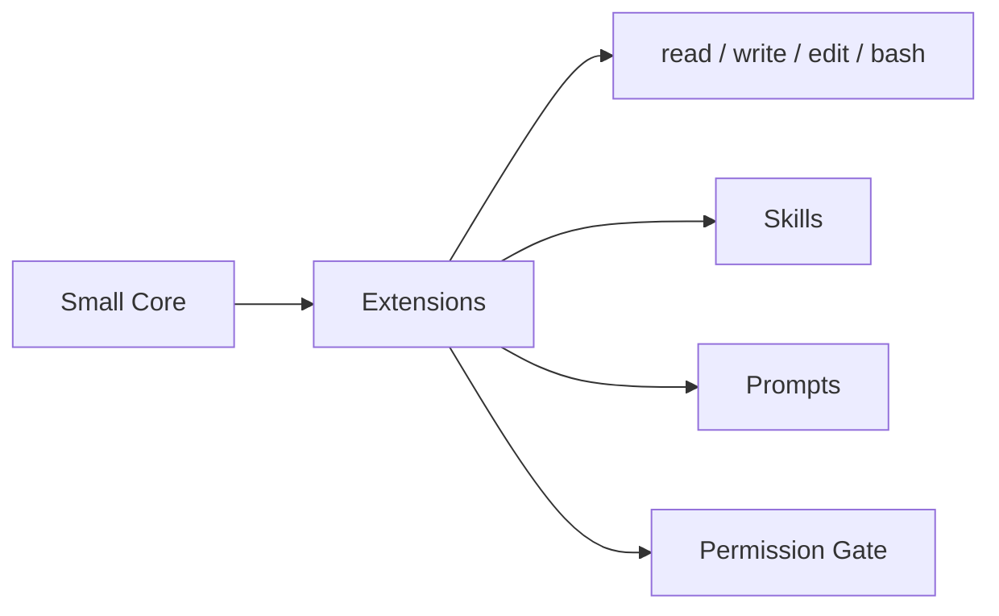
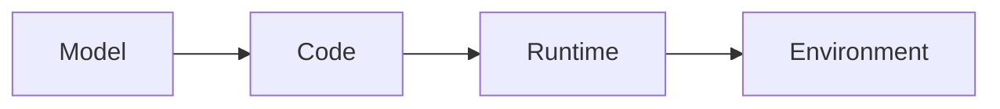
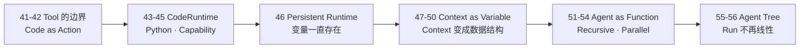

# Stage 5 · Hello RLM

> <span class="stage-badge">Stage 5</span> · Git Tag 范围：<span class="tag-badge">v41-tool-limit</span> ~ <span class="tag-badge">v56-rlm</span>

Stage 4走完之后，我们已经收获了一个 **Extensible Coding Agent**——小核心 + 扩展优先，工具、技能、提示词、权限都能按需生长。

但一路走来，你有没有发现一件事正在悄悄变味：工具越来越多。`read`、`write`、`edit`、`bash`、`grep`、`glob`、`git`、`search`、`database`……每个新能力都意味着一个新的 Tool Schema、新的参数校验、新的调用约定。当这个清单膨胀到几十个的时候，你会有一种强烈的感觉——**不对劲**。

也是从这一篇开始，我们要向第二个真实世界里的优秀项目学习——**Prime Agent**。如果说 Stage 4 的 Pi 是「怎么把 Harness 做小、做可扩展」，那么 Prime Agent 就是「当模型越来越会写代码时，Harness 应该换一种活法」的答案。

如果你刚读完 `40-hello-pi-style-harness`，心里可能正带着一个疑问走进这一篇：

> **模型已经这么会写代码了，我们为什么还要给它几十个 JSON Tool？**

接下来，这一篇就是 Stage 5 的开篇总览，回答三件事：

1. 我们为什么选择学习 Prime Agent？
2. 什么是 RLM，从 Tool Calling 到 Code as Action 意味着什么？
3. 这一 Stage 完成之后，我们会得到一个怎样的 Recursive Runtime Agent？

<!-- more -->

## 一、先复习：我们手上有什么

Stage 4 攒下的东西，可以浓缩成一张图：



**它已经是一个非常规整的 Tool-Calling Harness**：能力以扩展形态组织，权限可控，可观察性拉满。

但这条路的尽头，藏着一个越来越尖锐的矛盾。模型面对的是：

```text
几十个精心设计的 Tool Schema
```

于是 Harness 的核心问题永远是：

```text
有哪些工具？参数是什么？什么时候调用？结果怎么放回上下文？
```

> **Harness 正在替模型组合能力——而这件事，模型自己明明更擅长。**

## 二、先认识一下：Prime Agent 是什么？我们为什么学它？

**Prime Agent** 是一个开源的自改进 RLM Agent，由 [PrimeIntellect](https://github.com/PrimeIntellect-ai) 维护，官方定位是：

> **A self-improving RLM agent for coding workflows and long-running autonomous tasks.**

Prime Agent 公开架构的核心，正是围绕两个我们接下来要学的抽象展开的（[官方架构文档](https://github.com/PrimeIntellect-ai/prime-agent/blob/main/packages/coding-agent/docs/index.md)）：

> - **Recursive Language Model (RLM)**：把 Context 当作变量（prompt-as-a-variable），把递归子 Agent 这类工具当作函数调用（programmatic tool / sub-agent calling），这一切发生在**一个持久的 REPL** 里。
> - **Continual Harness**：把补充提示词、记忆、技能描述、可复用的子 Agent 规格，作为可持续改进的 Harness State 存下来。

放到我们自己的演进路线上，一眼就能对上号：

```text
Prime Agent 的 RLM 抽象                          → 我们这一整个 Stage 5
├── Persistent IPython 可编程环境                  → 46 Persistent Runtime
├── Context as Variable（prompt-as-a-variable）   → 47-50 Context as Variable / Search / Compaction
├── 子 Agent 作为函数调用（programmatic calling）   → 51-54 Agent as Function / Recursive / Parallel
└── Agent Tree                                     → 55-56 Agent Tree
```

而 Stage 4 我们刚学的 Pi，恰好就是 Prime Agent 的底座——它在 README 里明确写着「Our agent and TUI is built on top of pi」。这条承袭关系非常有戏剧性：

> **Stage 4 我们学 Pi：把 Harness 做小、做可扩展。Stage 5 我们学 Prime Agent：在这套小核心之上，把「让模型选工具」彻底换成「让模型编程组合能力」。**

### 那为什么是 Prime Agent，而不是别的？

| 我们的诉求 | Prime Agent 为什么契合 |
| --- | --- |
| **亲历「第二次跃迁」** | RLM 正是「Tool Calling → Code as Action」最完整的开源实践，我们想学的跃迁它已经走完了 |
| **抽象恰好是本阶段的课程表** | Persistent Runtime / Context as Variable / Recursive Subagent / Agent Tree，与我们 41–56 章一一对应 |
| **承袭我们的前作** | 它建立在 Pi 之上，和我们「Stage 4 学 Pi、Stage 5 学它」的路线无缝衔接 |
| **同时预告下一阶段** | 它的 Continual Harness 抽象，就是 Stage 6 我们要做的另一半 |

同样的学习姿态也要立住：

> **学 Prime Agent 的思想，不绑死 Prime Agent 的实现。** 它会用 persistent IPython、Python-backed skills、daemon 后台会话等一整套生产级工程；我们只提取「让模型编程、让 Context 可变、让 Agent 可递归」这几个核心思想，用最小实现亲手写出来。

## 三、什么是 RLM，什么是 Code as Action？

RLM（Recursive Language Model）是整套教程的**第二次最大跃迁**。它从一个极其朴素的问题出发：

> **如果模型已经会写代码，为什么还非要它去「点选」一个个 JSON Tool？**

答案指向一次架构反转：不再让模型在**预定义的 Tool 清单**里选动作，而是给模型一个**可编程环境**，让模型自己组合能力：



以前：

```text
LLM → Tool
```

现在：

```text
LLM → Program → Tool
```

模型不再输出：

```json
{ "name": "read_file", "arguments": { "path": "src/index.ts" } }
```

而是直接写：

```python
content = await fs.read("src/index.ts")
print(content)
```

循环、条件、过滤、聚合、并行、组合工具、维护变量——**模型自己用代码表达一切**。Harness 不需要再为每一个复杂流程造一个 Tool，因为「编程语言」本身就是一个无限可组合的 Tool。

> **一句话记住它与前面所有阶段的分工：**
> **Tool Calling 让模型「选」能力，Code as Action 让模型「写」能力——从被 Harness 喂菜单，到亲手掌勺。**

## 四、它如何成长为一个 Recursive Runtime Agent？

这是这一 Stage 最重要的一条叙事线。成长不是「推翻重来」，而是**一次彻彻底底的换引擎**——从「Tool Registry」换成「Code Runtime」，然后再一层层长出 RLM 的独特形态：



| 阶段 | 章节 | 补上的能力 | 对应成长 |
| --- | --- | --- | --- |
| **发现边界** | 41–42 | Tool 爆炸 → 模型用代码组合能力 | 从「几十个 Tool」变成「一个 Runtime」 |
| **换掉引擎** | 43–45 | `CodeRuntime` 抽象 → Python Runtime → Capability Runtime（fs / shell / git / search / skills / agents） | 从「Tool Registry」变成「可编程环境」 |
| **让变量活着** | 46 | Persistent Kernel：`x = load_project()`，下一步 `analyze(x)` 还能用 | 从「每次执行即死」变成「状态跨步骤存活」 |
| **Context 变数据结构** | 47–50 | Runtime State + Context as Variable + Search + Compaction | 从「Harness 塞给模型一串消息」变成「模型自己 search / slice / summarize」 |
| **Agent 变成函数** | 51–54 | `agent()` 可调用、可递归、可 `gather` 并行 | 从「一条 trajectory」变成「一棵 Agent 树」 |
| **收束为树** | 55–56 | `AgentNode`：parent / children / run | 从「线性 Steps」变成「递归 Run 树」 |

对照着看，每一步都踩在前一步的肩膀上：

- 没有 41–42 对 Tool 边界的质疑，43 的 CodeRuntime 就无从谈起；
- 没有 43 的抽象，44 的 Python、45 的 Capability 就没有挂载点；
- 没有 45 的能力注入，46 的 Persistent Kernel 就没有「可操作的世界」；
- 没有 46 的持久化 Runtime，47–50 的 Context 就不会变成一个「可查询的数据结构」；
- 没有 47–50 的 Context 革命，51–54 的递归 Agent 就会把上下文复制得爆炸；
- 没有 51–54 的 Agent as Function，55–56 的 Agent Tree 就只是一棵树状图。

> **这就是演进叙事：不是每次加一个独立新功能，而是把「模型怎么干活」这个引擎，从选工具一路换到写代码、再换到递归。**

## 五、这一 Stage 完成之后，我们会得到一个怎样的 Agent？

毕业作品叫 **Recursive Runtime Agent**——模型在一个持久化的可编程环境里写代码干活，还能按需 spawn 子 Agent、并行协作、形成一棵 Agent 树。

先看它长成什么样：

```mermaid
flowchart LR
  U[hello "分析这个项目"] --> RT[Python Runtime<br/>Persistent Kernel]
  RT --> FS[fs / shell / git]
  RT --> SK[Skills]
  RT --> AG[Agents]
  AG --> S1[Subagent A]
  AG --> S2[Subagent B]
  AG --> S3[Subagent C]
```

对比 Stage 4 的 Extensible Coding Agent，能力一目了然：

| 维度 | Stage 4 · Extensible Coding Agent | Stage 5 · Recursive Runtime Agent |
| --- | --- | --- |
| 模型的动作 | 从 Tool 清单里选 | 写代码组合能力 |
| 核心抽象 | Tool Registry | CodeRuntime |
| 执行方式 | 一次调用一个 Tool | Persistent Kernel，状态跨步骤存活 |
| Context | Harness 管理的消息数组 | 模型可操作的**数据结构** |
| Agent 形态 | 单一线性 Steps | Agent Tree（递归 + 并行） |
| 核心心智 | 小核心 + 扩展 | **一个可编程环境 + 一棵递归的 Agent 树** |

> 一句话概括 Stage 5 的目标：
> **把「让模型选工具」的 Harness，升级成「让模型编程组合能力、并能递归并行干活」的 Recursive Runtime Agent。**

## 六、章节清单

| # | 章节 | Git Tag | 状态 |
| --- | --- | --- | --- |
| 41 | [Tool Calling 的边界](41-tool-calling-limits) | v41-tool-limit | <span class="badge-done">正文完成</span> |
| 42 | [Code as Action](42-code-as-action) | v42-code-as-action | <span class="badge-done">正文完成</span> |
| 43 | [CodeRuntime 抽象](43-code-runtime) | v43-code-runtime | <span class="badge-done">正文完成</span> |
| 44 | [Python Runtime](44-python-runtime) | v44-python-runtime | <span class="badge-done">正文完成</span> |
| 45 | [Capability Runtime](45-capability-runtime) | v45-capability-runtime | <span class="badge-done">正文完成</span> |
| 46 | [Persistent Runtime](46-persistent-runtime) | v46-persistent-runtime | <span class="badge-done">正文完成</span> |
| 47 | [Runtime State](47-runtime-state) | v47-runtime-state | <span class="badge-done">正文完成</span> |
| 48 | [Context as Variable](48-context-as-variable) | v48-context-variable | <span class="badge-done">正文完成</span> |
| 49 | [Context Search](49-context-search) | v49-context-search | <span class="stage-badge">规划中</span> |
| 50 | [Context Compaction](50-context-compaction) | v50-context-compaction | <span class="stage-badge">规划中</span> |
| 51 | [Agent as Function](51-agent-as-function) | v51-agent-function | <span class="stage-badge">规划中</span> |
| 52 | [Recursive Agent](52-recursive-agent) | v52-recursive-agent | <span class="stage-badge">规划中</span> |
| 53 | [Subagent Context](53-subagent-context) | v53-subagent-context | <span class="stage-badge">规划中</span> |
| 54 | [Parallel Subagents](54-parallel-subagents) | v54-parallel-agent | <span class="stage-badge">规划中</span> |
| 55 | [Agent Tree](55-agent-tree) | v55-agent-tree | <span class="stage-badge">规划中</span> |
| 56 | [Hello RLM](56-hello-rlm) | v56-rlm | <span class="stage-badge">规划中</span> |

## 阶段结尾

这一阶段结束：**Recursive Runtime Agent**——模型在一个 Persistent Runtime 里编程组合能力，Context 变成它可操作的数据结构，Agent 从一条线性 trajectory 长成一棵可递归、可并行的树。

> **记住这一 Stage 的灵魂一句：**
> **如果模型已经很会写代码，Harness 就不需要替它造几十个 Tool——给它一个可编程环境，让模型自己组合能力。**

下一阶段，我们要回答整套教程最「危险」也最迷人的问题：如果 Agent 已经能写代码、能干复杂活了，**它能不能改进自己的 Harness？**——Harness 的状态从此不再是开发者的领地，这就是 **Continual Harness**。
