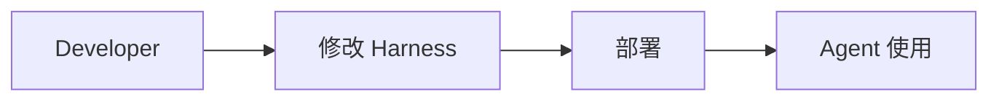
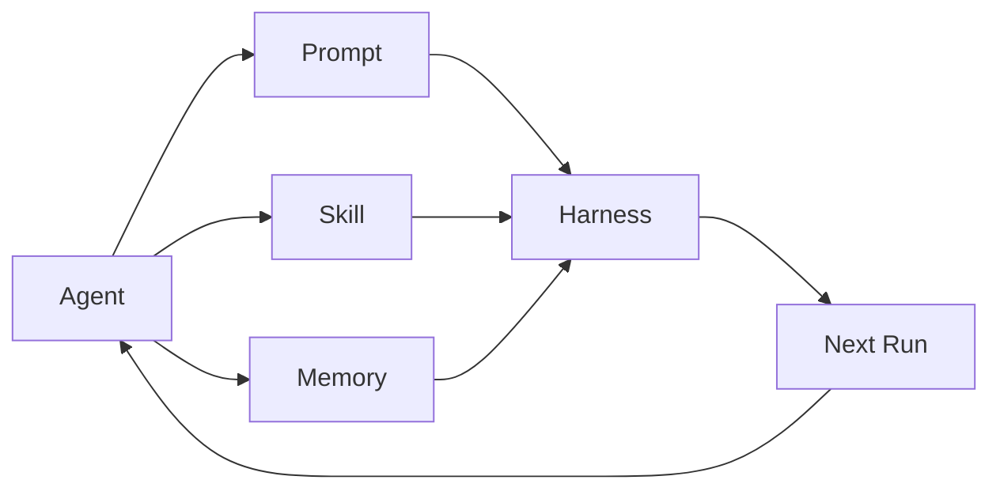
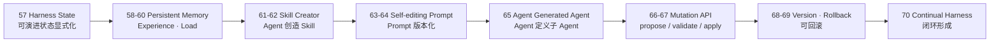
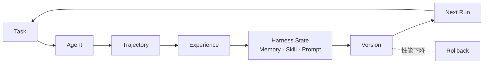

# Stage 6 · Hello Continual Harness

> <span class="stage-badge">Stage 6</span> · Git Tag 范围：<span class="tag-badge">v57-harness-state</span> ~ <span class="tag-badge">v70-continual-harness</span>

Stage 5之后，我们收获了一个 **Recursive Runtime Agent**——模型在持久化的可编程环境里写代码干活，Context 是它可操作的数据结构，还能递归 spawn 子 Agent、并行协作。

但你把整个系列看到这里，会发现所有阶段都有一个共同的前提，安静地躺在角落里：

> **Harness 是开发者写的，Agent 只是「使用」它。**

提示词是你写的，工具是你注册的，技能是你定义的，会话是你管理的——Agent 再聪明，也只能在开发者划好的圈子里打转。那问题来了：

如果你刚读完 `56-hello-rlm`，心里可能正带着一个疑问走进这一篇：

> **如果 Agent 已经这么强了，为什么改进 Harness 这件事，只能由人来干？**

接下来，这一篇就是 Stage 6 的开篇总览，回答三件事：

1. 什么是 Continual Harness？
2. 为什么「Agent 修改 Harness 状态」是第三次架构跃迁？
3. 这一 Stage 完成之后，我们会得到一个怎样的 Self-Adapting Agent？

<!-- more -->

## 一、先复习：我们手上有什么

前面五个 Stage 攒下的东西，可以浓缩成一张图：



**传统 Harness 的方向是单向的**：

```text
Developer builds Harness
    ↓
Agent uses Harness
```

无论 Agent 多聪明，它都生活在一个**由开发者一次性配好、之后基本不变**的环境里。提示词不对了？人改。工具不好使了？人换。经验积累下来了？人写进文档，Agent 下次还是一无所知。

> 换句话说：前面五个 Stage 的 Agent 是个**绝顶聪明、但从不自我更新的员工**——干一次活长一分见识，但见识从来不会被它自己沉淀下来。

## 二、什么是 Continual Harness？

中文直译「持续的 Harness」。它把上面那张单向图，弯成一个**环**：



传统 Harness 里，Prompt、Skill、Memory 是**喂给 Agent 的固定配置**；在 Continual Harness 里，它们变成了 **Agent 可以创建、读取、更新、删除的 Harness State**：

```ts
interface HarnessState {
  prompt;    // Agent 可以提议修改
  skills;    // Agent 可以创建/更新
  memory;    // Agent 可以写入经验
  agents;    // Agent 可以定义子 Agent
  policies;  // Agent 可以提议策略
}
```

**重点关注**：这里有一条必须守住的红线——

> **Continual 不是让 Agent 随意改写 Core 源码。** 所有可变更都收敛在「受控的 Harness State」上：`propose → validate → apply → version → rollback`，每一步都留审计记录。自我改进绝不等于自我破坏。

一句话记住它与前面所有阶段的分工：

> **前面是「Developer builds Harness，Agent uses Harness」；这一阶段是「Agent can modify Harness State」——Harness 本身成为 Agent 可以演进的领地。**

## 三、它如何成长为一个 Self-Adapting Agent？

这是这一 Stage 最重要的一条叙事线。成长不是「推翻重来」，而是**把「自我进化」从口号拆成一步一步可实现的台阶**——从显式状态，到记忆，到技能，到提示词，再到受控的变更机制：



| 阶段 | 章节 | 补上的能力 | 对应成长 |
| --- | --- | --- | --- |
| **显式化状态** | 57 | `HarnessState`：prompt / skills / memory / agents / policies | 从「散落各处的配置」变成「可被 Agent 触达的状态」 |
| **建立记忆** | 58–60 | Persistent Memory → 任务 Experience → 下次任务加载 | 从「干完就忘」变成「跨任务学习」 |
| **创造技能** | 61–62 | Agent 发现重复流程 → `create_skill()` → 验证 → 安装 | 从「人写 Skill」变成「Agent 自己沉淀 Skill」 |
| **编辑提示词** | 63–64 | Prompt Proposal → Validation → Version → Activation | 从「提示词写死」变成「提示词可版本化演进」 |
| **生成 Agent** | 65 | `code-reviewer` / `test-agent` / `research-agent` | 从「人定义 Agent」变成「Agent 定义 Agent」 |
| **受控变更** | 66–67 | `HarnessMutation` + 权限：propose / validate / apply | 从「任意写入」变成「一切变更受控可审计」 |
| **可回滚** | 68–69 | Harness Version + 性能下降时 rollback | 从「改了就不能反悔」变成「Self-improving ≠ Self-destructing」 |
| **形成闭环** | 70 | Task → Agent → Experience → Harness Update → Next Task | 从「一次性工具」变成「持续演进的生命体」 |

对照着看，每一步都踩在前一步的肩膀上：

- 没有 57 的 HarnessState，58–65 的修改就找不到「修改对象」；
- 没有 58–60 的记忆，61 的 Skill Creator 就只是「临时技巧」而非「经验沉淀」；
- 没有 61–62 的技能机制，63–64 的提示词演进就缺了最核心的载体；
- 没有 63–65 的演进能力，66–67 的 Mutation API 就没有东西可管控；
- 没有 66–67 的受控机制，68–69 的版本与回滚就是一句空话。

> **这就是演进叙事：不是每次加一个独立新功能，而是把「自我进化」一层一层地从口号变成可验证的代码。**

## 四、这一 Stage 完成之后，我们会得到一个怎样的 Agent？

毕业作品叫 **Persistent Self-Adapting Agent**——一个能记住经验、沉淀 Skill、演进提示词，并且一切变更都可版本化、可回滚的 Continual Harness。

先看它长成什么样：



对比 Stage 5 的 Recursive Runtime Agent，能力一目了然：

| 维度 | Stage 5 · Recursive Runtime Agent | Stage 6 · Continual Harness |
| --- | --- | --- |
| 谁在改进 Harness | 开发者 | **Agent 自己** |
| 可改的东西 | 无（Harness 是固定的） | prompt / skills / memory / agents / policies |
| 记忆 | 任务内消息历史 | **跨任务的 Persistent Memory** |
| Skill | 开发者预置 | Agent 自己 create / validate / install |
| 变更控制 | 无 | Mutation API：propose → validate → apply → version → rollback |
| 核心心智 | 可编程环境 + 递归树 | **Harness 本身成为 Agent 可演进的状态** |

> 一句话概括 Stage 6 的目标：
> **把「Agent 使用 Harness」升级成「Agent 改进 Harness」——让 Agent 的记忆、技能、提示词都能在一个受控、可回滚的闭环里持续演进。**

## 五、章节清单

| # | 章节 | Git Tag | 状态 |
| --- | --- | --- | --- |
| 57 | [Harness State](57-harness-state) | v57-harness-state | <span class="stage-badge">规划中</span> |
| 58 | [Persistent Memory](58-persistent-memory) | v58-memory | <span class="stage-badge">规划中</span> |
| 59 | [Experience](59-experience) | v59-experience | <span class="stage-badge">规划中</span> |
| 60 | [Load Experience](60-load-experience) | v60-experience-load | <span class="stage-badge">规划中</span> |
| 61 | [Agent Generated Skill](61-agent-generated-skill) | v61-generated-skill | <span class="stage-badge">规划中</span> |
| 62 | [Skill Creator](62-skill-creator) | v62-skill-creator | <span class="stage-badge">规划中</span> |
| 63 | [Self-editing Prompt](63-self-editing-prompt) | v63-self-edit-prompt | <span class="stage-badge">规划中</span> |
| 64 | [Prompt Versioning](64-prompt-versioning) | v64-prompt-version | <span class="stage-badge">规划中</span> |
| 65 | [Agent Generated Agent](65-agent-generated-agent) | v65-generated-agent | <span class="stage-badge">规划中</span> |
| 66 | [Harness Mutation API](66-harness-mutation-api) | v66-mutation-api | <span class="stage-badge">规划中</span> |
| 67 | [Mutation Permission](67-mutation-permission) | v67-mutation-policy | <span class="stage-badge">规划中</span> |
| 68 | [Harness Version](68-harness-version) | v68-harness-version | <span class="stage-badge">规划中</span> |
| 69 | [Rollback](69-rollback) | v69-rollback | <span class="stage-badge">规划中</span> |
| 70 | [Hello Continual Harness](70-hello-continual-harness) | v70-continual-harness | <span class="stage-badge">规划中</span> |

## 阶段结尾

这一阶段结束：**Persistent Self-Adapting Agent**——任务完成后沉淀经验，经验加载进下一次任务，Skill 与 Prompt 在受控的版本机制里持续演进，一切变更可审计、可回滚。

> **记住这一 Stage 的灵魂一句：**
> **Agent 不只是 Harness 的使用者，也可以是 Harness 的演进者——但每一步演进都必须受控、可版本化、可回滚。**

下一阶段，我们要给这套「自我进化」装上**科学的地基**：没有 Evaluation 的自我改进，只是 Agent 在自说自话。Task、Trajectory、Verifier、Reward、Regression——把「我变好了」变成可测量、可对比、可证明的工程。
