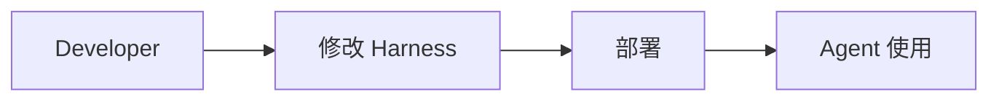
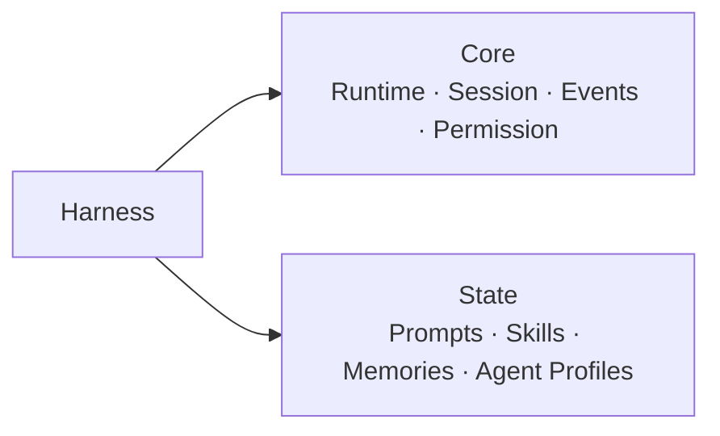
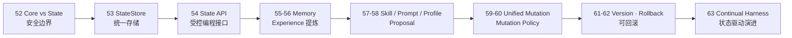
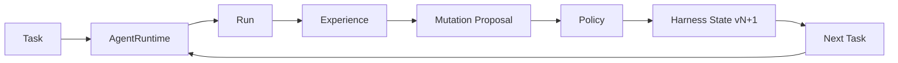

# Stage 6 · Hello Continual Harness

> <span class="stage-badge">Stage 6</span> · Git Tag 范围：<span class="tag-badge">v52-harness-core-state</span> ~ <span class="tag-badge">v63-continual-harness</span>

Stage 5 之后，我们收获了一个 **Programmatic Agent（RLM 编程模型）**——模型通过可编程控制面复用、组合前面所有阶段攒下的 Harness 能力，`await read(...)`、`await skill(...)`、`await agent(...)` 都还是那套 Harness。

但你把整个系列看到这里，会发现所有阶段都有一个共同的前提，安静地躺在角落里：

> **Harness 是开发者写的，Agent 只是「使用」它。**

提示词是你写的，工具是你注册的，技能是你定义的，会话是你管理的——Agent 再聪明，也只能在开发者划好的圈子里打转。那问题来了：

如果你刚读完 `51-rlm`，心里可能正带着一个疑问走进这一篇：

> **如果 Agent 已经这么强了，为什么改进 Harness 这件事，只能由人来干？**

接下来，这一篇就是 Stage 6 的开篇总览，回答三件事：

1. 什么是 Continual Harness？
2. 为什么「Agent 修改 Harness 状态」是第三次架构跃迁？
3. 这一 Stage 完成之后，我们会得到一个怎样的 Continual Harness？

<!-- more -->

## 一、先复习：我们手上有什么

前面五个 Stage 攒下的东西，可以浓缩成一张图：



**传统 Harness 的方向是单向的**：

```text
Developer builds Harness
    ↓
Agent uses Harness
```

无论 Agent 多聪明，它都生活在一个**由开发者一次性配好、之后基本不变**的环境里。提示词不对了？人改。工具不好使了？人换。经验积累下来了？人写进文档，Agent 下次还是一无所知。

> 换句话说：前面五个 Stage 的 Agent 是个**绝顶聪明、但从不自我更新的员工**——干一次活长一分见识，但见识从来不会被它自己沉淀下来。

## 二、什么是 Continual Harness？

这一阶段的统一命题是：

> **Agent 如何在不破坏 Core Runtime 的前提下，受控地修改 Harness 的可演进状态。**

### 第一步：明确「什么能改，什么不能改」



> **Agent 可以修改 Harness State，但不能随意修改 Harness Core。** 这是 Continual 阶段最重要的安全边界。

### 第二步：State 变成统一、持久、可版本化

```text
HarnessState
  ├── prompts
  ├── skills
  ├── memories
  └── agents
     ↓ 统一 StateStore + Programmatic State API
```

Agent 不再 `fs.write` 直改，而是走受控的编程函数：

```python
await harness.memory.create(...)
await harness.skills.propose(...)
await harness.prompt.propose(...)
await harness.agents.propose(...)
```

### 第三步：一切变化收敛为受控 Mutation

```text
Proposal → Validate → Authorize → Apply → Version
```

> 一句话记住它与前面所有阶段的分工：
> **前面是「Developer builds Harness，Agent uses Harness」；这一阶段是「Agent can modify Harness State」——Harness 本身成为 Agent 可以受控演进的领地。**

## 三、它如何成长为一个 Continual Harness？

成长不是「推翻重来」，而是沿着一条清晰的演进线：**先把 State 与 Core 分离，再统一存储，再开放受控 API，再把 Memory / Skill / Prompt / AgentProfile 全部纳入统一 Mutation 与版本管理**：



| 阶段 | 章节 | 补上的能力 | 对应成长 |
| --- | --- | --- | --- |
| **划清边界** | 52 | `Harness = Core + State`，「能改 State、不能改 Core」 | 从「一团代码」变成「可演进状态 + 不可碰核心」 |
| **统一存储** | 53 | `.harness/` 统一 store（prompts / skills / memories / agents） | 从「散落各处」变成「所有可演进资产有共同去处」 |
| **受控 API** | 54 | `await harness.memory/skills/prompt/agents...` | 从「fs 直改」变成「走 Permission / Validation / Event / Version」 |
| **建立记忆** | 55–56 | Memory 是 State 资产；从 Run 的 Steps/Tools 提炼 Experience | 从「干完就忘」变成「跨 Run 保留经验」 |
| **创造能力** | 57–58 | Skill Proposal；Prompt / Agent Profile Proposal | 从「人写 Skill / Prompt」变成「Agent 提出候选改变」 |
| **统一变更** | 59–60 | `HarnessMutation` 单一类型 + Mutation Policy（allow / deny / ask） | 从「各自为政的改进系统」变成「一条 Mutation Pipeline」 |
| **可回滚** | 61–62 | State 每次修改产生版本 + 技术上的 Rollback | 从「改了就不能反悔」变成「Continual ≠ 不可逆漂移」 |
| **形成闭环** | 63 | Static → Versioned Mutable State → Continual | 从「一次性 Harness」变成「可持续变化」 |

> **这就是演进叙事：不是每次加一个独立新功能，而是把「自我进化」从口号，受控地落到可版本化的 Harness State 上。**

## 四、这一 Stage 完成之后，我们会得到什么？

毕业作品叫 **Continual Harness**——一个 Harness State 可以受控演进的 Harness：



对比 Stage 5 的 Programmatic Agent，能力一目了然：

| 维度 | Stage 5 · Programmatic Agent | Stage 6 · Continual Harness |
| --- | --- | --- |
| 谁在改进 Harness | 开发者 | **Agent（受控地）** |
| 可改的东西 | 无（Harness 是固定的） | prompts / skills / memories / agents |
| 与 Core 的关系 | 使用 Core 能力 | **修改 State，不碰 Core** |
| 记忆 | 任务内 Working State | **跨 Run 的 Memory（Experience 提炼）** |
| Skill / Prompt | 开发者预置 | Agent 提出 Candidate 变更 |
| 变更控制 | 无 | Mutation Pipeline：propose → validate → authorize → apply → version → rollback |

> 一句话概括 Stage 6 的目标：
> **把「Agent 使用 Harness」升级成「Agent 受控地改进 Harness」——一切可演进状态在统一 Pipeline 里版本化运行，并且随时可回滚。**

## 五、章节清单

| # | 章节 | Git Tag | 状态 |
| --- | --- | --- | --- |
| 52 | [Harness Core 与 Harness State](52-harness-core-state) | v52-harness-core-state | <span class="stage-badge">规划中</span> |
| 53 | [Harness State Store](53-harness-state-store) | v53-harness-state-store | <span class="stage-badge">规划中</span> |
| 54 | [Programmatic Harness State API](54-programmatic-state-api) | v54-programmatic-state-api | <span class="stage-badge">规划中</span> |
| 55 | [Memory as Harness State](55-memory-harness-state) | v55-memory-harness-state | <span class="stage-badge">规划中</span> |
| 56 | [从 Run 提炼 Experience](56-experience-extraction) | v56-experience-extraction | <span class="stage-badge">规划中</span> |
| 57 | [Agent Generated Skill](57-agent-generated-skill) | v57-generated-skill | <span class="stage-badge">规划中</span> |
| 58 | [Prompt / Agent Profile Proposal](58-prompt-agent-profile-proposal) | v58-prompt-profile-proposal | <span class="stage-badge">规划中</span> |
| 59 | [Unified Harness Mutation](59-unified-harness-mutation) | v59-unified-mutation | <span class="stage-badge">规划中</span> |
| 60 | [Mutation Policy](60-mutation-policy) | v60-mutation-policy | <span class="stage-badge">规划中</span> |
| 61 | [Harness State Versioning](61-harness-state-versioning) | v61-state-versioning | <span class="stage-badge">规划中</span> |
| 62 | [Rollback](62-rollback) | v62-rollback | <span class="stage-badge">规划中</span> |
| 63 | [Hello Continual Harness](63-hello-continual-harness) | v63-continual-harness | <span class="stage-badge">规划中</span> |

## 阶段结尾

这一阶段结束：**Continual Harness**——Harness 的可演进状态受控地由执行经验驱动产生变化，每步变更都可审计、可版本化、可回滚。

> **记住这一 Stage 的灵魂一句：**
> **Agent 不只是 Harness 的使用者，也可以是 Harness 的演进者——但每一步演进都必须受控、可版本化、可回滚。**

不过，先停一下：Agent 现在「会修改」Harness 了，但**会修改 ≠ 会变好**。谁来客观证明一次修改真的有用？——这就是 **Stage 7 · Hello Agent Lab** 要回答的问题。