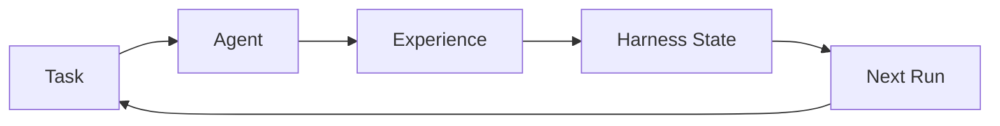
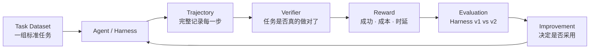
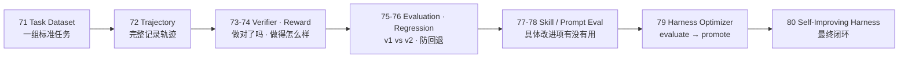
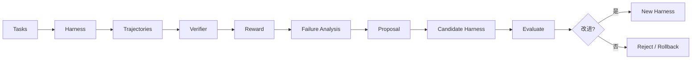

# Stage 7 · Hello Agent Lab

> Stage 7 · Git Tag 范围：v71-task-dataset ~ v80-self-improving

来到最后这一阶段，我们将基于前面完成的一个相对成熟的 **Continual Harness**——Agent 能记住经验、沉淀 Skill、演进提示词，一切变更受控、可版本化、可回滚。

但等等，你仔细想想，会发现 Stage 6 藏着一个「皇帝的新衣」级别的问题：

> **Agent 说它变好了，凭什么信它？**

你让 Harness 自我改进了半天——改了提示词、换了 Skill、调了 Agent——然后它跟你说「我现在更厉害了」。这句话**没有任何证据**。它也许真的变好了，也许只是这次碰巧，也许它把 A 类任务做好的代价是搞砸了 B 类任务。

如果你刚读完 `70-hello-continual-harness`，心里可能正带着一个疑问走进这一篇：

> **自我改进要是没有科学的测量，怎么知道它不是自嗨？**

接下来，这一篇就是 Stage 7 的开篇总览，回答三件事：

1. 什么是 Agent Lab？
2. 为什么 Evaluation 是自我改进的「科学地基」？
3. 这一 Stage 完成之后，我们会得到一个怎样的 Self-Improving Harness？

<!-- more -->

## 一、先复习：我们手上有什么

Stage 6 攒下的东西，可以浓缩成一张图：

**循环是闭环了**——任务 → 经验 → 改进 Harness → 下一次任务。但注意这个环上缺了什么东西？

- 没有**任务集**：凭什么说这次任务代表了真实能力？
- 没有**打分**：「变好了」是多好？在哪些任务上？
- 没有**对比**：改进前 vs 改进后，谁更强？
- 没有**回归**：A 类任务变好了，B 类任务是不是悄悄变差了？

> 换句话说：Stage 6 让 Agent 会「自我改进」，但 Stage 7 要回答的是更硬的问题——**改进得好不好，由谁说了算？怎么才算数？**

## 二、什么是 Agent Lab，为什么 Evaluation 是地基？

中文直译「智能体实验室」。前面六个 Stage，我们在**建造** Harness；这一 Stage，我们要给这间实验室装上**测量仪器**。

核心命题只有一句话：

> **没有 Evaluation 的自我改进，只是 Agent 的自说自话。**

要让「自我改进」从宣传词变成可证明的事实，Harness 必须长出这样一条科学链路：

**重点关注**：这条链路回答了三个以前没人敢问的问题：

1. **做对了吗？**（Verifier）——不是模型说对了就算，而是测试、lint、typecheck、期望文件都能验证；
2. **做得怎么样？**（Reward）——成功了但有代价：token 成本、步数、时延，都要算进账；
3. **比之前好吗？**（Evaluation）——Harness v1 和 v2 在同一组任务上对比，还要防住回归。

一句话记住它与前面所有阶段的分工：

> **前面六个 Stage 让 Agent「会干活、会管理、会演进」；这一 Stage 让 Harness「会证明自己变好了」——把自我改进从感觉升级成科学工程。**

## 三、它如何成长为一个 Evaluated Self-Improving Harness？

这是这一 Stage 最重要的一条叙事线。成长不是「推翻重来」，而是**一层一层给「自我改进」装上科学仪器**：

| 阶段 | 章节 | 补上的能力 | 对应成长 |
| --- | --- | --- | --- |
| **建立标准** | 71 | `tasks/easy` / `medium` / `hard` 任务集 | 从「随机测一测」变成「有标准任务集」 |
| **记录轨迹** | 72 | Trajectory：messages / steps / tools / runtime code / subagents / tokens / latency / cost | 从「跑完就忘」变成「每一步都可回放审计」 |
| **判定对错** | 73–74 | `Verifier`（tests / lint / typecheck / snapshot）+ Reward（success − cost − latency） | 从「模型自述成功」变成「可验证、可打分」 |
| **比较版本** | 75–76 | Harness v1 vs v2 评测 + Regression 防回退 | 从「感觉变好了」变成「数据证明变好了」 |
| **评测单项** | 77–78 | Skill Evaluation（用了几次？成功率？）+ Prompt Evaluation（benchmark） | 从「整体玄学」变成「逐项归因」 |
| **自动优化** | 79 | Harness Optimizer：evaluate → find failures → generate improvements → test → promote | 从「人工调参」变成「循环自动改进」 |
| **最终闭环** | 80 | 完整闭环：Tasks → Harness → Trajectories → Verifier → Reward → Proposal → Candidate → Evaluate → Promote | 从「一次性 Harness」变成「可自我证明进步的体系」 |

对照着看，每一步都踩在前一步的肩膀上：

- 没有 71 的任务集，72 的轨迹就「不知道在测什么」；
- 没有 72 的完整轨迹，73 的 Verifier 就没有可验证的对象；
- 没有 73–74 的对错与打分，75 的版本对比就无从比较；
- 没有 75–76 的整体评测，77–78 的逐项归因就缺少基准；
- 没有 77–78 的归因，79 的 Optimizer 就不知道该改进谁；
- 没有 79 的自动优化，80 的最终闭环就只是一张漂亮的流程图。

> **这就是演进叙事：不是每次加一个独立新功能，而是把「自我改进」从玄学，一层一层变成可测量、可对比、可证明的工程。**

## 四、这一 Stage 完成之后，我们会得到一个怎样的 Harness？

毕业作品叫 **Evaluated Self-Improving Harness**——整个教程的最终闭环：一个能在一组标准任务上证明自己变好、并在失败分析中持续自我改进的 Harness。

先看它长成什么样：

对比 Stage 6 的 Continual Harness，能力一目了然：

| 维度 | Stage 6 · Continual Harness | Stage 7 · Evaluated Self-Improving Harness |
| --- | --- | --- |
| 怎么知道变好了 | 靠描述、靠感觉 | **Task Dataset + Verifier + Reward + Regression** |
| 任务标准 | 无固定任务集 | `tasks/easy / medium / hard` |
| 改进依据 | Agent 自述 | 失败分析 + 可复现评测 |
| 版本对比 | 只有版本号 | Harness v1 vs v2 可量化对比 |
| 防回退 | 人工回滚 | Regression 自动把关 |
| 核心心智 | Harness 可演进 | **Harness 的每一次演进都有科学证据** |

> 一句话概括 Stage 7 的目标：
> **把「Agent 会自我改进」的 Continual Harness，升级成「每次改进都被评测证明」的 Self-Improving Harness——自我改进从此不再是感觉，而是工程。**

## 五、章节清单

| # | 章节 | Git Tag | 状态 |
| --- | --- | --- | --- |
| 71 | [Task Dataset](71-task-dataset) | v71-task-dataset | 规划中 |
| 72 | [Trajectory](72-trajectory) | v72-trajectory | 规划中 |
| 73 | [Verifier](73-verifier) | v73-verifier | 规划中 |
| 74 | [Reward](74-reward) | v74-reward | 规划中 |
| 75 | [Evaluation](75-evaluation) | v75-evaluation | 规划中 |
| 76 | [Regression](76-regression) | v76-regression | 规划中 |
| 77 | [Skill Evaluation](77-skill-evaluation) | v77-skill-eval | 规划中 |
| 78 | [Prompt Evaluation](78-prompt-evaluation) | v78-prompt-eval | 规划中 |
| 79 | [Harness Optimizer](79-harness-optimizer) | v79-optimizer | 规划中 |
| 80 | [Hello Self-Improving Harness](80-hello-self-improving-harness) | v80-self-improving | 规划中 |

## 阶段结尾

这一阶段结束：**Evaluated Self-Improving Harness**——Task Dataset、Trajectory、Verifier、Reward、Evaluation、Regression、Optimizer，把「自我改进」从感觉升级成可测量、可对比、可证明的科学工程，也为整个教程画上句号。

> **记住这一 Stage 的灵魂一句：**
> **「性能提升」必须由可复现评测证明——不能只凭模型自述或单次成功案例。**

到这里，`Hello Harness` 的完整弧线就闭环了：从一次模型调用（Hello LLM），到 Agent Loop、Minimal Harness、Coding Agent、Extensible Harness、RLM、Continual Harness，最终到被评测证明的 Self-Improving Harness——你亲手走完了现代 Coding Agent 的整个演进史。
