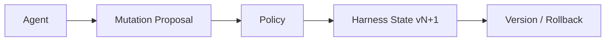
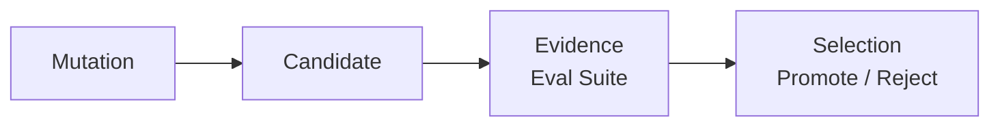
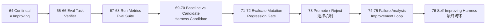
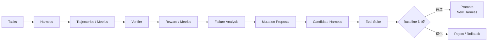

# Stage 7 · Hello Agent Lab

> <span class="stage-badge">Stage 7</span> · Git Tag 范围：<span class="tag-badge">v64-continual-vs-improving</span> ~ <span class="tag-badge">v76-self-improving</span>

来到最后这一阶段，我们将基于前面完成的一个相对成熟的 **Continual Harness**——Agent 能受控地修改 Harness State：存经验、提 Skill、改 Prompt、建 Agent Profile，一切变更走 `propose → validate → authorize → apply → version → rollback`。

但等等，你仔细想想，会发现 Stage 6 藏着一个「皇帝的新衣」级别的问题：

> **Agent 会修改自己，凭什么等于它变好了？**

你让 Harness 持续改了半天——改了提示词、加了 Skill、存了一堆经验——然后它跟你说「我现在更厉害了」。这句话**没有任何证据**。它也许真的变好了，也许只是这次碰巧，也许它把 A 类任务做好的代价是搞砸了 B 类任务。

如果你刚读完 `63-hello-continual-harness`，心里可能正带着一个疑问走进这一篇：

> **自我改进要是没有科学的测量，怎么知道它不是自嗨？**

接下来，这一篇就是 Stage 7 的开篇总览，回答三件事：

1. 为什么「会修改」不等于「会改进」？
2. 什么是 Evaluation Harness，如何客观评估一次 Harness 变更？
3. 这一 Stage 完成之后，我们会得到一个怎样的 Self-Improving Harness？

<!-- more -->

## 一、先复习：我们手上有什么

Stage 6 攒下的东西，可以浓缩成一张图：



**Harness 会持续变化了**——但注意这条链上缺了什么东西？

- 没有**可重复任务**：凭什么说这次任务代表了真实能力？
- 没有**客观判定**：「变好了」是多好？用谁验证？
- 没有**成本**：成功了但有代价，怎么算？
- 没有**对比**：改进前 vs 改进后，谁更强？
- 没有**回归**：A 类任务变好了，B 类任务是不是悄悄变差了？

> 换句话说：Stage 6 让 Harness 「会变化」，但 Stage 7 要回答的是更硬的问题——**一次变化是好是坏，由谁用证据说了算？**

## 二、核心命题：Continual ≠ Improving

> 会修改自己 ≠ 会改进自己。

Stage 6 可能产生更多 Memory、更多 Skills、更长 Prompt、更多 Agent Profile——但这些变化可能造成：

```text
更贵、更慢、更容易误调用、更高 Context 占用、更差成功率
```

所以：



> **Self-Improving Harness = Continual Mutation + Evaluation + Selection。** 最重要的概念不是 `Optimizer`，而是 **Candidate 能不能击败 Baseline**。

## 三、它如何成长为一个 Self-Improving Harness？

成长不是「推翻重来」，而是**一层一层给「自我改进」装上科学仪器**：



| 阶段 | 章节 | 补上的能力 | 对应成长 |
| --- | --- | --- | --- |
| **立住命题** | 64 | `会修改 ≠ 会改进`，引出 Evaluation | 从「继续变」变成「要证明变好」 |
| **建立标准** | 65–66 | `EvalTask`（固定输入 + fixture）+ `Verifier`（tests / typecheck / lint / expected file） | 从「随机测一测」变成「客观判定做对没有」 |
| **测量成本** | 67–68 | `RunMetrics`（steps / modelCalls / tokens / duration）+ 任务集合 `EvalSuite` | 从「成功/失败二值」变成「可比较的成本与效率」 |
| **相对比较** | 69–70 | `Baseline vs Candidate` + 可运行的 `HarnessCandidate` | 从「绝对评价」变成「相对比较」 |
| **统一评估** | 71 | 同一套 Eval Pipeline 评估所有 Mutation | 从「各写一套 Eval」变成「State Mutation 统一评估」 |
| **防回退** | 72 | `Regression Gate`：target improves AND overall >= baseline AND no critical regression | 从「局部提升」变成「全局不退化才晋升」 |
| **选择机制** | 73 | `Promote / Reject` 真正决定谁能进入 Harness State | 从「改了就算」变成「有证据地选择」 |
| **反推改进** | 74–75 | `Failure Analysis` → Improvement Hypothesis → 完整 `Improvement Loop` | 从「只知差」变成「知道下一步改什么并循环」 |
| **最终闭环** | 76 | 把整套教程收束为 Self-Improving Harness | 从「一次性 Harness」变成「可自我证明进步的体系」 |

> **这就是演进叙事：不是每次加一个独立新功能，而是把「自我改进」从玄学，一层一层变成可测量、可对比、可证明的工程。**

## 四、这一 Stage 完成之后，我们会得到一个怎样的 Harness？

毕业作品叫 **Self-Improving Harness**——整个教程的最终闭环：一个能在一组标准任务上证明自己变好、拒绝退化、并从失败分析中持续自我改进的 Harness。



对比 Stage 6 的 Continual Harness，能力一目了然：

| 维度 | Stage 6 · Continual Harness | Stage 7 · Self-Improving Harness |
| --- | --- | --- |
| 怎么知道变好了 | 靠描述、靠感觉 | **Eval Suite + Verifier + Regression Gate** |
| 任务标准 | 无固定任务集 | `EvalTask` + fixture + 可重复执行 |
| 改进依据 | Agent 自述 | 失败分析 + 可复现评测 |
| 版本对比 | 只有版本号 | Baseline vs Candidate 可量化对比 |
| 防回退 | 人工回滚 | Regression Gate 自动把关 |
| 核心心智 | Harness 可演进 | **Harness 的每一次演进都有科学证据** |

> 一句话概括 Stage 7 的目标：
> **把「Agent 会修改自己」的 Continual Harness，升级成「每次改进都被评测证明、退化被拒绝」的 Self-Improving Harness——自我改进从此不再是感觉，而是工程。**

## 五、章节清单

| # | 章节 | Git Tag | 状态 |
| --- | --- | --- | --- |
| 64 | [Continual ≠ Improving](64-continual-vs-improving) | v64-continual-vs-improving | <span class="stage-badge">规划中</span> |
| 65 | [Eval Task](65-eval-task) | v65-eval-task | <span class="stage-badge">规划中</span> |
| 66 | [Verifier](66-verifier) | v66-verifier | <span class="stage-badge">规划中</span> |
| 67 | [Run Metrics](67-run-metrics) | v67-run-metrics | <span class="stage-badge">规划中</span> |
| 68 | [Eval Suite](68-eval-suite) | v68-eval-suite | <span class="stage-badge">规划中</span> |
| 69 | [Baseline vs Candidate](69-baseline-candidate) | v69-baseline-candidate | <span class="stage-badge">规划中</span> |
| 70 | [Harness Candidate](70-harness-candidate) | v70-harness-candidate | <span class="stage-badge">规划中</span> |
| 71 | [Evaluate Harness Mutation](71-evaluate-mutation) | v71-evaluate-mutation | <span class="stage-badge">规划中</span> |
| 72 | [Regression Gate](72-regression-gate) | v72-regression-gate | <span class="stage-badge">规划中</span> |
| 73 | [Promote / Reject](73-promote-reject) | v73-promote-reject | <span class="stage-badge">规划中</span> |
| 74 | [Failure Analysis](74-failure-analysis) | v74-failure-analysis | <span class="stage-badge">规划中</span> |
| 75 | [Improvement Loop](75-improvement-loop) | v75-improvement-loop | <span class="stage-badge">规划中</span> |
| 76 | [Hello Self-Improving Harness](76-hello-self-improving-harness) | v76-self-improving | <span class="stage-badge">规划中</span> |

## 阶段结尾

这一阶段结束：**Self-Improving Harness**——EvalTask、Verifier、RunMetrics、EvalSuite、Baseline vs Candidate、Regression Gate、Promote/Reject、Failure Analysis、Improvement Loop，把「自我改进」从感觉升级成可测量、可对比、可证明的科学工程，也为整个教程画上句号。

> **记住这一 Stage 的灵魂一句：**
> **「性能提升」必须由可复现评测证明——不能只凭模型自述或单次成功案例。**

到这里，`Hello Harness` 的完整弧线就闭环了：从一次模型调用（Hello LLM），到 Agent Loop、Minimal Harness、Coding Agent、Extensible Harness、Programmatic Agent（RLM）、Continual Harness，最终到被评测证明的 Self-Improving Harness——你亲手走完了现代 Coding Agent 的整个演进史。